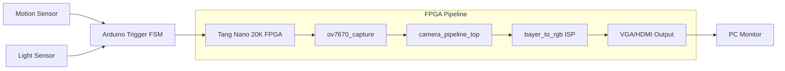
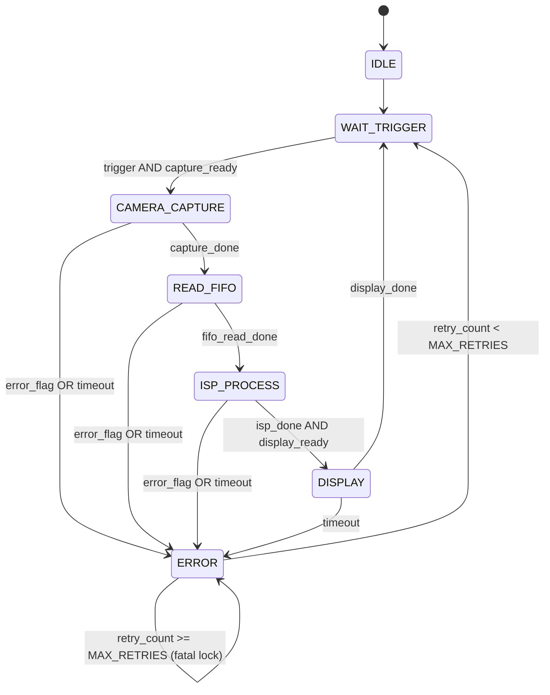
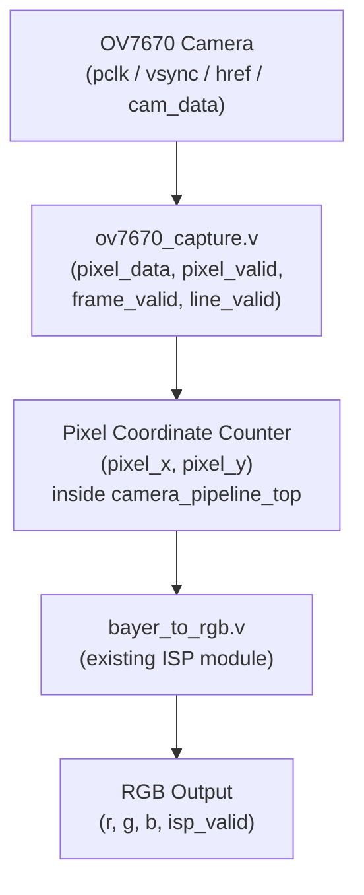
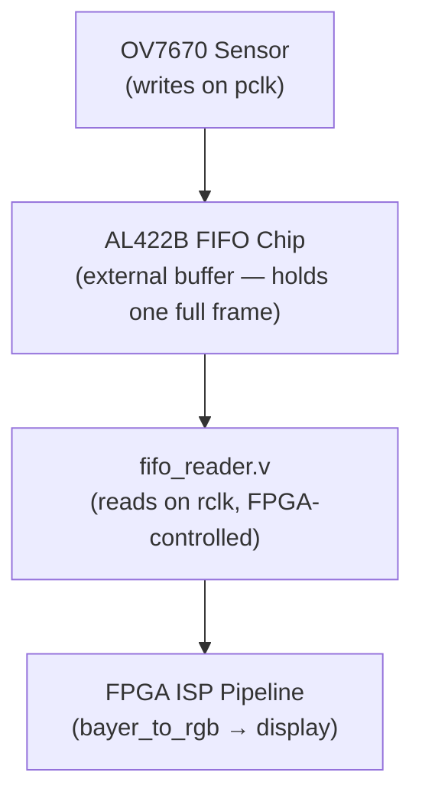

# FPGA Vision Project

Real-time FPGA-based image processing system using:

- Tang Nano 20K FPGA
- OV7670 FIFO Camera
- Arduino motion/light trigger
- Bayer-to-RGB ISP pipeline
- VGA/HDMI video output

---

# System Architecture



---

# Main FSM

The main FSM controls the high-level pipeline state. It includes timeout detection,
stage-ready handshaking, and automatic retry with a configurable retry limit.



---

# Camera Interface Pipeline

The camera interface infrastructure connects a physical OV7670 camera module to the FPGA ISP pipeline.
All modules in this section operate in the `pclk` clock domain unless otherwise noted.

## Key Camera Signals

| Signal | Direction | Description |
|--------|-----------|-------------|
| `pclk` | Camera → FPGA | Pixel clock generated by the OV7670 (~24 MHz). Every rising edge delivers one byte of pixel data. The FPGA must sample all camera signals synchronously on this clock. |
| `vsync` | Camera → FPGA | Vertical sync. Goes **HIGH** during the blanking gap between frames. Goes **LOW** when the sensor starts sending active pixel rows. Used to detect frame boundaries. |
| `href` | Camera → FPGA | Horizontal reference. Goes **HIGH** while a row of pixels is being sent, **LOW** during the horizontal blanking gap between rows. One byte appears on `cam_data` per `pclk` while `href` is HIGH. |
| `cam_data[7:0]` | Camera → FPGA | Raw 8-bit Bayer byte from the sensor, valid on each `pclk` edge when `href` is HIGH. |

## Why Clock-Domain Handling Matters

The OV7670's `pclk` and the Tang Nano's system clock are **asynchronous** — they have no fixed phase relationship and can drift relative to each other over time. Sampling `cam_data` on the system clock would cause metastability (random bit corruption). The solution is to keep all camera-side capture logic in the `pclk` domain, then cross to the system clock domain at a safe synchronised boundary — typically through a FIFO buffer. All three camera modules below run on `pclk` to avoid this problem.

## Raw OV7670 vs OV7670+FIFO

| | Raw OV7670 | OV7670 with AL422B FIFO |
|---|---|---|
| Data path | Camera writes directly to FPGA pins on `pclk` | Camera writes into external FIFO; FPGA reads at its own pace |
| FPGA constraint | Must process every byte at `pclk` rate (~24 MHz) | Can read the full frame any time after capture completes |
| Missed pixels | FPGA busy = pixel lost forever | FIFO buffers the entire frame safely |
| Clock coupling | FPGA and camera tightly coupled | `pclk` (write side) and `rclk` (read side) are independent |
| This project uses | `ov7670_capture.v` models the direct path | `fifo_reader.v` models the buffered read path |

## Modules

### `ov7670_capture.v`

Synchronously captures raw 8-bit Bayer pixels from the OV7670 camera, running entirely in the `pclk` domain.

On every rising `pclk` edge it:
- Latches `href` into `line_valid`
- Inverts `vsync` into `frame_valid` (HIGH = frame is active, LOW = blanking)
- When `href` is HIGH: latches `cam_data` into `pixel_data` and asserts `pixel_valid` for one cycle

```
pclk edge:   __|‾|__|‾|__|‾|__|‾|__|‾|__
href:        ______|‾‾‾‾‾‾‾‾‾‾‾‾‾‾|_____
cam_data:    ------D0--D1--D2--D3--------
pixel_valid: __________|‾|_|‾|_|‾|_|‾|__  (one cycle per byte, 1-cycle pipeline delay)
```

### `fifo_reader.v`

Models the FPGA-side read controller for an AL422B-style FIFO. Runs on a separate `rclk` (the FPGA read clock), independent of `pclk`.

Timing model:
- **Cycle N**: `fifo_empty=0` → asserts `fifo_rd_en`; FIFO begins driving data
- **Cycle N+1**: data appears on `fifo_data` → captured into `pixel_out`, `pixel_valid` pulses for one cycle
- **End of stream**: when `fifo_empty` goes HIGH, `fifo_rd_en` de-asserts and `pixel_valid` stops cleanly (no ghost pulses)

### `camera_pipeline_top.v`

Top-level simulation stub that connects the camera capture front-end to the ISP. Replaces the synthetic `image_generator.v` source with real camera signals.

Internal structure:
1. Instantiates `ov7670_capture` to generate `pixel_valid`, `pixel_data`, `frame_valid`, `line_valid`
2. Tracks pixel coordinates (`pixel_x`, `pixel_y`) from `href`/`vsync` edges — no VGA controller needed
3. Feeds coordinates and pixel data into `bayer_to_rgb` ISP
4. Outputs `r`, `g`, `b`, `isp_valid`

## Pipeline Diagram



## FIFO Architecture Diagram



---

# Planned Modules

## RTL
- `main_fsm.v` — pipeline control FSM with timeout, retry, and debug outputs
- `bayer_to_rgb.v` — Bayer RAW to RGB ISP
- `image_generator.v` — synthetic image source for simulation
- `vga_controller.v` — 640×480 @ 60 Hz VGA timing
- `video_test_top.v` — VGA + image generator integration
- `isp_test_top.v` — synthetic ISP pipeline (VGA + image_generator + bayer_to_rgb)
- `ov7670_capture.v` — OV7670 camera capture front-end (pclk domain)
- `fifo_reader.v` — AL422B FIFO read controller (rclk domain)
- `camera_pipeline_top.v` — full camera-to-ISP pipeline (simulation stub)

## Testbenches
- `main_fsm_tb.v`
- `bayer_to_rgb_tb.v`
- `image_generator_tb.v`
- `vga_controller_tb.v`
- `video_test_top_tb.v`
- `isp_test_top_tb.v`
- `ov7670_capture_tb.v`
- `fifo_reader_tb.v`
- `camera_pipeline_top_tb.v`

---

# Project Goals

- Real-time image streaming from OV7670 camera
- FPGA ISP pipeline (Bayer RAW → RGB)
- Bayer demosaicing with RGGB pattern
- HDMI/VGA timing generation
- Sensor-triggered image capture (motion + darkness)
- Modular FPGA architecture (simulation-first)
- Camera clock-domain handling (`pclk` isolation)
- OV7670 direct and FIFO-buffered integration paths
- FIFO-based image buffering (AL422B)
- Real-time camera ISP pipeline (camera signals → RGB output)
- Pipeline FSM with timeout detection and automatic error retry
