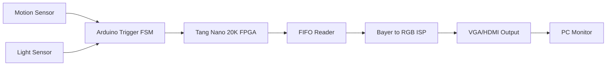
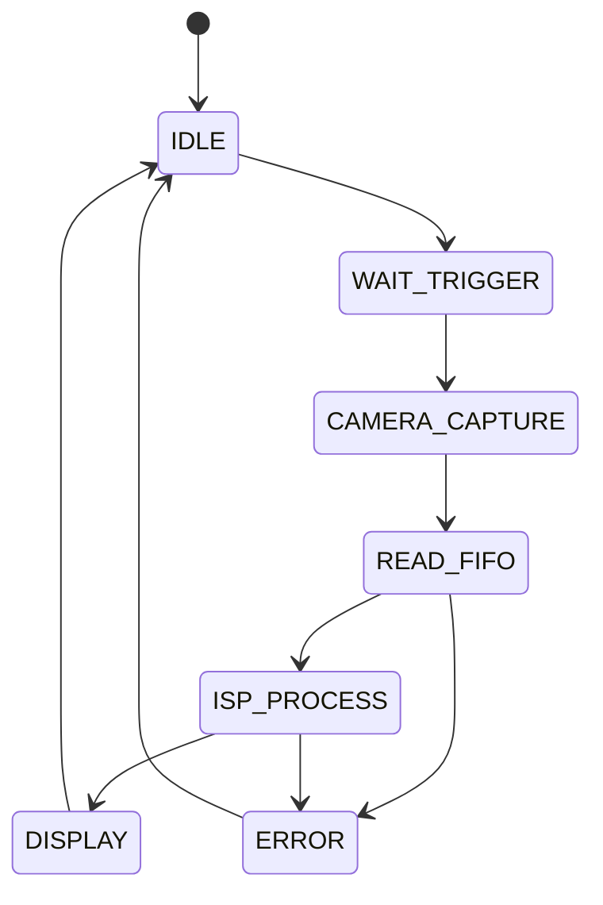

# FPGA Vision Project

Real-time FPGA-based image processing system using:

- Tang Nano 20K FPGA
- OV7670 FIFO Camera
- Arduino motion/light trigger
- Bayer-to-RGB ISP pipeline
- VGA/HDMI video output

---

# System Architecture

---

# Main FSM

---

# Planned Modules

## RTL
- main_fsm.v
- bayer_to_rgb.v
- image_generator.v
- vga_controller.v

## Testbenches
- main_fsm_tb.v
- bayer_to_rgb_tb.v

---

# Project Goals

- Real-time image streaming
- FPGA ISP pipeline
- Bayer RAW processing
- HDMI/VGA timing generation
- Sensor-triggered image capture
- Modular FPGA architecture